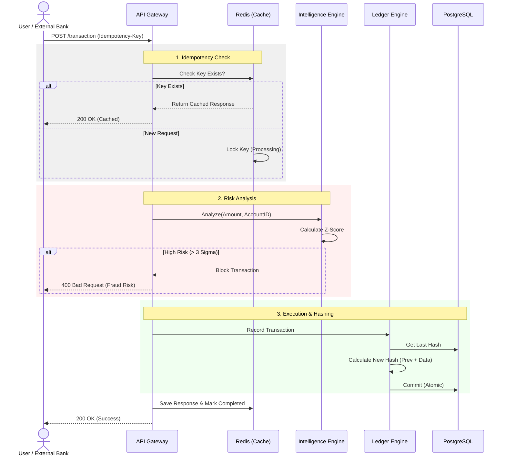
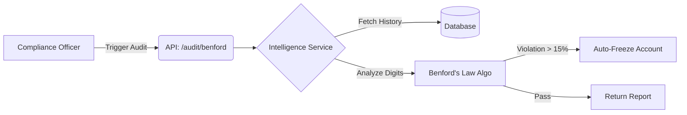

# 🏦 Iron Vault Ledger

**High-Integrity Core Banking Ledger with Financial Intelligence & Fraud Detection.**

> **⛷️ Jump to Usage:** [How to Run (Docker)](#-how-to-run) | [Top Priority](#-top-priority-advanced-aml-intelligence)

---

## 📖 About The Project

**Iron Vault Ledger** is a backend simulation of a Core Banking System designed for high data integrity, auditability, and real-time financial intelligence. While universally applicable, its design choices (like ISO 20022 parsing and stringent data integrity) are heavily influenced by the regulatory and business environment of the European (specifically DACH) financial sector. Unlike standard accounting software, this ledger treats every transaction as an immutable record within a hash chain (similar to blockchain concepts but centralized), ensuring that historical data cannot be tampered with without detection.

> **Note on Scope:** The current Financial Intelligence module (Z-Score & Benford) is strictly optimized for **Debit/Outflow Analysis**. This prioritizes the immediate protection of account holders against theft and unauthorized spending.

### Key Features

1.  **Immutable Ledger (Crypto-Shredding & Hashing)**
    *   Every journal entry is cryptographically linked to the previous one (`prev_hash`).
    *   Includes a "Verify Integrity" endpoint to detect DB tampering instantly.
    *   Supports GDPR-compliant data deletion via crypto-shredding (destroying the encryption key renders the description unreadable).

2.  **Financial Intelligence (AI/Stats)**
    *   **Benford's Law Analysis:** Forensic audit tool to detect artificial/fake transaction data.
    *   **Z-Score Anomaly Detection:** Real-time blocking of transactions that deviate significantly (3-sigma) from an account's behavioral profile.
    *   **Automated Freeze:** Accounts detected with high fraud risk are automatically frozen (`FROZEN` status).

3.  **Robust API Architecture**
    *   **Idempotency:** Uses Redis to prevent double-spending or duplicate processing of the same request ID.
    *   **ISO 20022 Support:** Capable of parsing and importing standard banking XML (`pacs.008`) payment files.
    *   **Atomic Transactions:** Ensures strict ACID compliance; money never disappears in the middle of a process.

---

## Business Flow & Architecture

### Transaction Flow

How a transaction travels from a User/Bank to the Immutable Database:



### Compliance Audit Flow

How the system detects fraud proactively:



---

## Tech Stack & Architecture

The project follows a **Service-Repository Pattern** to separate business logic from API handling.

### Core Stack
*   **Language:** Python 3.10+
*   **Framework:** FastAPI (High performance, Async support)
*   **Database:** PostgreSQL (Relational integrity, ACID)
*   **ORM:** SQLModel (Type-safe interaction with DB)
*   **Caching/Locking:** Redis (Idempotency keys, Background tasks)
*   **Testing:** Pytest (Unit & Integration Testing)
*   **Containerization:** Docker & Docker Compose

### Project Structure

```bash
├── app/
│   ├── api/v1/          # API Routers (Endpoints)
│   ├── core/            # Config, Security, Auth
│   ├── models/          # Database Models (Account, JournalEntry)
│   ├── services/        # Business Logic (Ledger, Intelligence, ISO Parser)
│   └── main.py          # App Entrypoint
├── tests/               # Pytest Suites (Unit & Integration)
├── docker-compose.yml   # Infrastructure Orchestration
└── requirements.txt     # Dependencies
```

---

## ⚙️ How to Run

### Prerequisites
*   Docker & Docker Compose installed on your machine.

### Steps

1.  **Clone the Repository**
    ```bash
    git clone https://github.com/yourusername/iron-vault-ledger.git
    cd iron-vault-ledger
    ```

2.  **Configure Environment**
    Create a `.env` file from the example and configure your secrets.
    ```bash
    cp .env.example .env
    # Edit .env if you want to change passwords or keys
    ```

3.  **Start the Server (Docker)**
    This command builds the images and starts the API server, Database, and Redis in the background.
    ```bash
    docker-compose up --build -d
    ```
    *The backend server is now running at `http://localhost:8000`.*

4.  **Apply Migrations**
    Create the database tables:
    ```bash
    docker-compose exec web alembic upgrade head
    ```

5.  **Seed Database (Optional)**
    Populate the database with initial accounts and test data:
    ```bash
    docker-compose exec web python scripts/seed_db.py
    ```

6.  **Access the Application**
    *   **API Root:** `http://localhost:8000`
    *   **Interactive Docs (Swagger UI):** `http://localhost:8000/docs`
    *   **ReDoc:** `http://localhost:8000/redoc`

7.  **Database Monitoring (pgAdmin/DBeaver)**
    To connect to the database from your local machine:
    *   **Host:** `localhost`
    *   **Port:** `5433` (Mapped to internal 5432 to avoid conflicts with local Postgres).
    *   **Database:** `ironvault`
    *   **User/Password:** Defined in `.env` (default: `postgres`/`postgres`).

    > **Note:** The port mapping (`5433:5432`) is configured in `docker-compose.yml`. You can change the host port there and rebuild if needed.

### 🛠️ Useful Commands

*   **View Server Logs:** `docker-compose logs -f web` (To see Uvicorn output/errors)
*   **Stop Server:** `docker-compose down`
*   **Restart Server:** `docker-compose restart web`

### Testing the Endpoints

1.  Go to **Swagger UI** (`/docs`).
2.  **Register/Login:** Use `/auth/register` and `/auth/token` to get a Bearer Token.
3.  **Authorize:** Click the "Authorize" button and paste your token.
4.  **Simulate Transaction:** Use `POST /ledger/transaction`.
    *   *Try sending the same request twice with the same `Idempotency-Key` header to see the caching in action.*
5.  **Import ISO 20022 XML:** Use `POST /ledger/transaction/import-xml`.
    *   *Don't have a `pacs.008` file? (Usually provided by clearing systems or partners like GoCardless).*
    *   **Generate a dummy XML file:**
        ```bash
        docker-compose exec web python scripts/generate_xml.py
        ```
6.  **Audit:** Use `POST /intelligence/audit/{id}/benford` to run a fraud check.

---

### Running Tests

To run the comprehensive test suite (covering Ledger Integrity, Concurrency, and Intelligence):

```bash
docker-compose exec web pytest
```
---

## Future Work

The project aims to deepen its **Financial Intelligence** capabilities, moving from a Core Ledger to an Intelligent Audit System:

*   **Credit-Side Analysis (AML):**
    *   *Why Debit First?* The current version prioritizes **Debit Analysis** to prevent immediate asset loss (Theft/Fraud).
    *   *Next Step:* Implement **Credit Analysis** (Inflows) to detect **Money Laundering** patterns (e.g., Money Mules, Structuring/Smurfing).
*   **Graph-Based Fraud Detection:** Detect circular money laundering rings using graph algorithms.
*   **Predictive Cash Flow:** Implement time-series forecasting for account balances.
*   **Behavioral Biometrics:** Analyze transaction timing patterns to flag account takeovers.